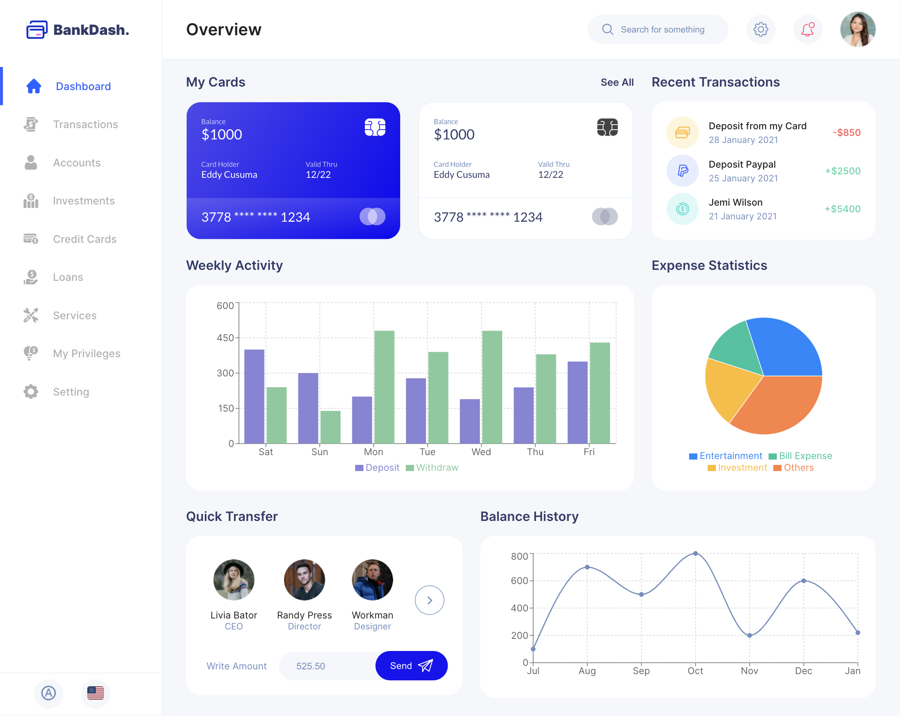
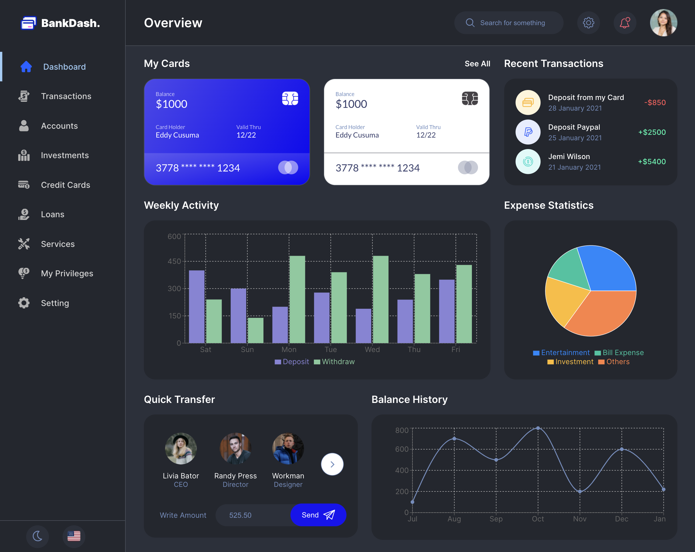
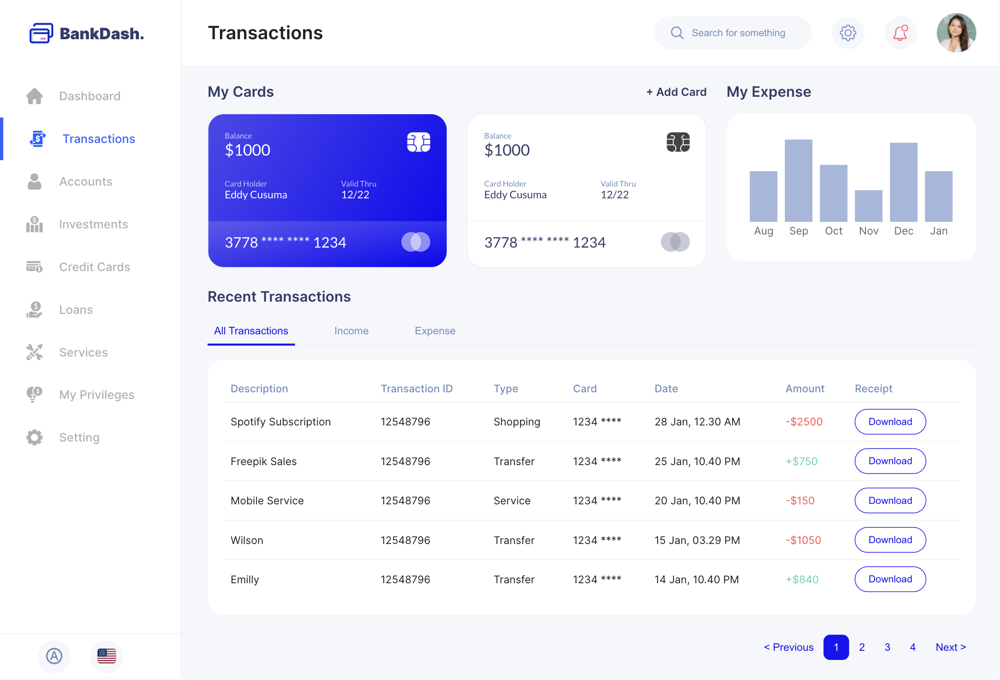
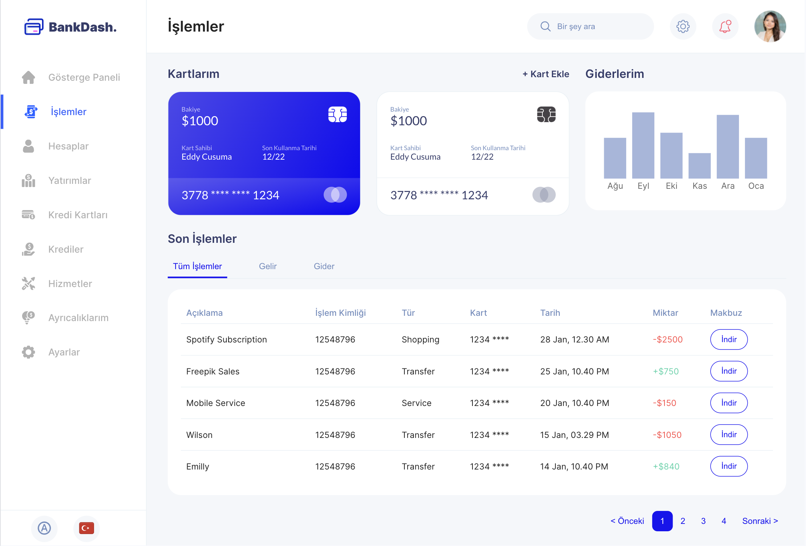
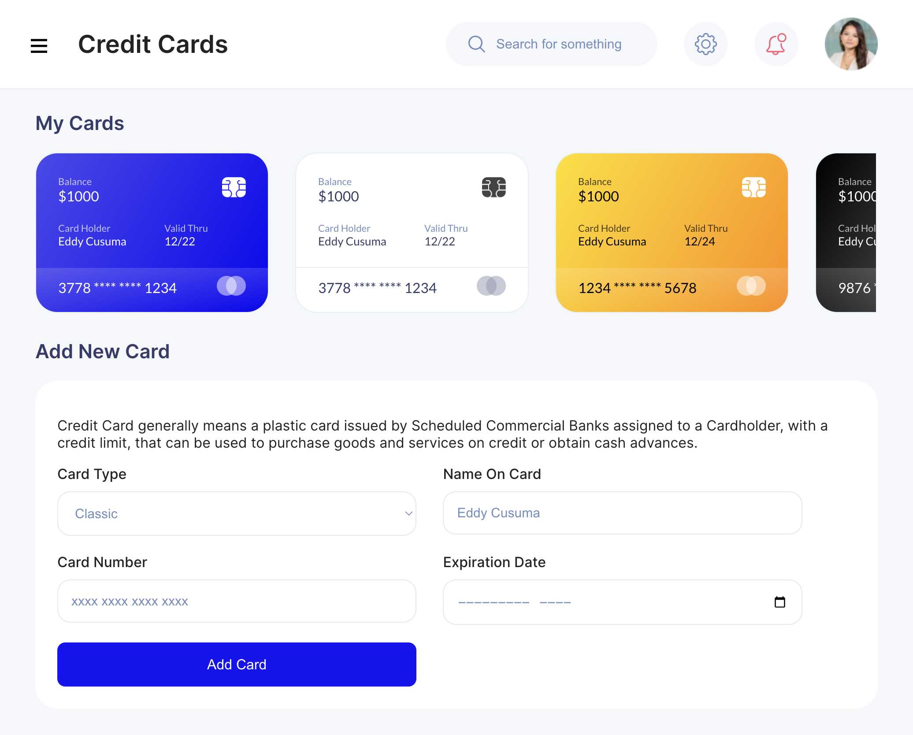
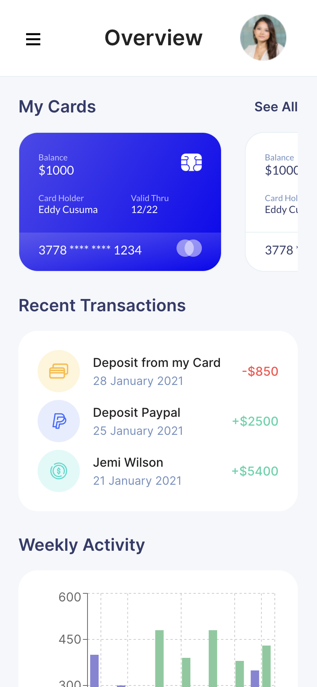
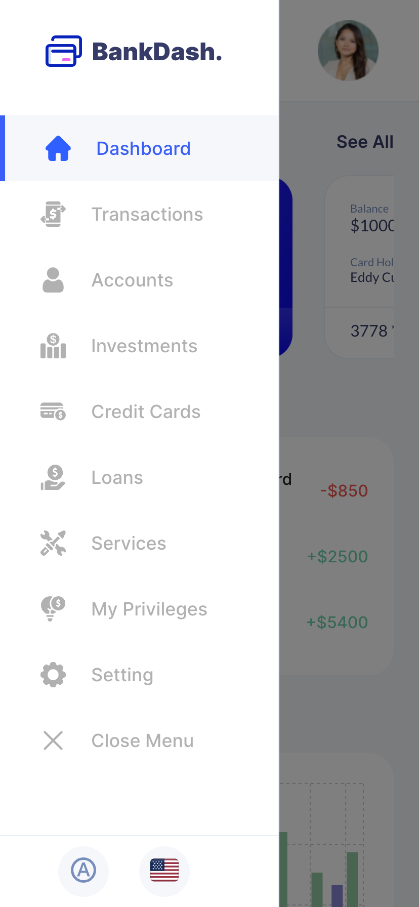

# Finance Dashboard

This project is a finance dashboard built during my internship at INNOVA. The dashboard is designed to help users manage and track their financial activities.

In order to use React in more detail and produce different components, I focused on the dashboard, transactions, and credit card pages. 

## Features

- **Dashboard Overview:** A comprehensive overview of all financial activities.
- **Transactions:** Track your financial transactions.
- **Credit Cards:** View your credit cards and add new cards.
- **Dark/Light Theme:** Switch between light, dark, and auto (system) themes.
- **Multilingual Support:** Switch between English and Turkish.
- **Responsive Design:** Support mobile, tablet and desktop.

## Tech Stack
  - React.js
  - React Router
  - React i18next for localization
  - Rechars
  - CSS for styling
  - JSON server (for demonstration purposes)

## Getting Started

### Prerequisites

Make sure you have the following installed on your system:

- Node.js (v14 or higher)
- npm (v6 or higher)

### Installation

1. Clone the repository:
```
git clone https://github.com/higurbuzz/finance-dashboard.git
cd finance-dashboard
```

2. Install the dependencies:
```
npm install
```

3. Start the JSON server:
```
npx json-server --watch data/db.json --port 8000
```

4. Start the React development server:
```
npm start
```
The app should now be running at http://localhost:3000.

 
## Screenshots 

### Theme Support
#### Light Theme | Dashboard Page (Current System Theme)


#### Dark Theme | Dashboard Page


### Language Support
#### English | Transactions Page


#### Turkish | Transactions Page


### Responsive Design
#### Tablet | Credit Cards Page


#### Mobile | Dashboard Page


#### Mobile | Menu


## Acknowledgments
This project was developed during my internship at INNOVA. Special thanks to [Fırat Orhan](https://firatorhan.com/) for their support and guidance. 

The design of this dashboard is based on a concept by Seju, available on [Figma](https://www.figma.com/community/file/1323695683687017923).
